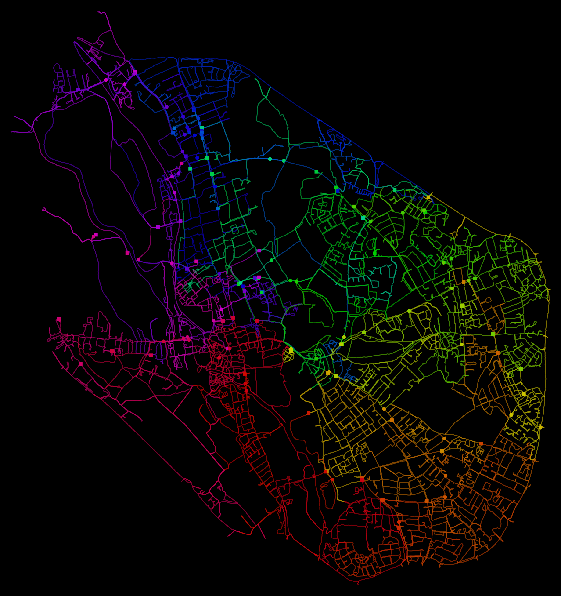

# Walking Oxford scripts



I walked every public road inside the ring road of Oxford, UK, tracking my walks on my phone. It took 76 walks covering about 601 km of unique roads and paths. Including repeats, I covered over 690 km. 

I used Apple Fitness and Footpath Route Planner apps to track the routes, and exported them to Google My Maps to keep track and plan routes. I also made an SVG map of the whole project.

I used these (largely vibecoded) scripts to wrangle the exported routes from my phone. The workflow was:

On iPhone:
* record each walk in either Apple Fitness or Footpaths
* in Apple Health, export all data (save to iCloud)

On Mac:
* run.sh : Mac-specific script to get data from iCloud and process it
* gpx_to_kml.py : Python script to generate KML/SVG files from Apple Health export
* convert.sh and convert-svg.sh : Bash scripts to invoke gpx_to_kml.py


# gpx_to_kml.py

`gpx_to_kml.py` combines GPX workout routes into a single KML file, or exports them as an SVG map. It uses Python 3 and the standard library.

By default, GPX files are read from `apple_health_export/workout-routes/`. The `--activity-type walking` and `--activity-type cycling` filters use `apple_health_export/export.xml` to identify workouts.

## Examples

Create a KML containing walking routes:

```sh
python3 gpx_to_kml.py --activity-type walking --output walking.kml
```

Create an SVG with bearing-based colors and translucent route segments:

```sh
python3 gpx_to_kml.py \
  --output-format svg \
  --activity-type walking \
  --color-order bearing \
  --colormap rainbow \
  --stroke-width 3 \
  --segment-opacity 0.3 \
  --segments-per-path 10 \
  --output walking.svg
```

## Useful options

- `--input-dir DIR` sets the folder containing `.gpx` files.
- `--include "LAT1,LON1" "LAT2,LON2"` only keeps points inside the rectangle defined by two opposite corners (to exclude routes that happened elsewhere and you don't want to include in the map)
- `--exclude LAT1,LON1 LAT2,LON2 LAT3,LON3 LAT4,LON4` trims points from the starts or ends of route that lie inside the specified quadrilateral. Repeat the option to add another quadrilateral. List corners in perimeter order.
- `--min-distance-metres N` reduces route detail by dropping points closer than `N` metres to the last kept point. Google My Maps has a limit of 5MB per upload.
- `--activity-type all|walking|cycling` filters routes. Walking and cycling require the Apple Health `export.xml` file; change its path with `--health-export`.
- `--colormap winter|autumn|cool|rainbow` and `--color-order date|bearing` control route colors. Bearing order uses the centroid of the included routes' starting points unless `--color-center LAT,LON` is supplied.
- SVG options: `--stroke-width PIXELS`, `--segment-opacity 0-1`, `--segments-per-path N`, `--route-marker-size N`, and `--include-markers`.
- `--output FILE` sets the output filename. Use `--output-format svg` for SVG; KML is the default.

Run `python3 gpx_to_kml.py --help` for the full option list.
